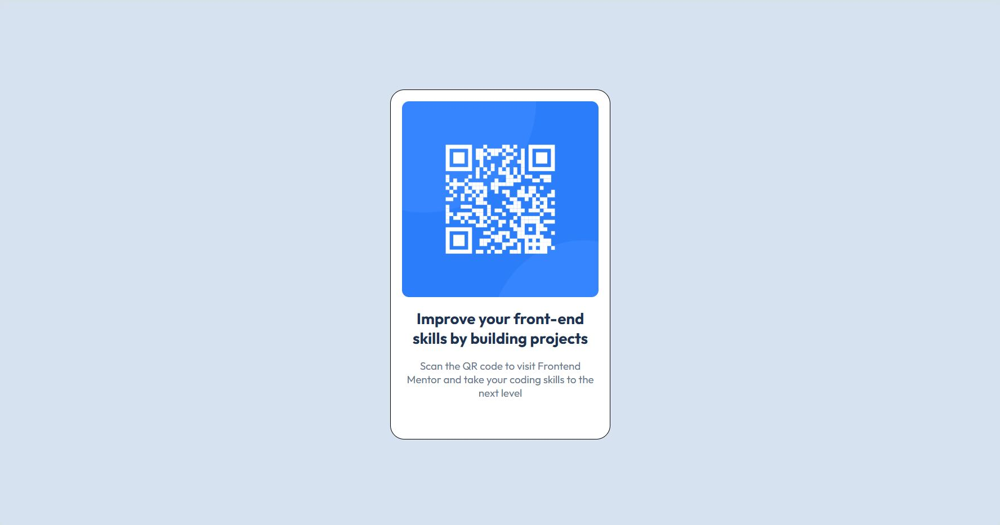

# Frontend Mentor - QR code component solution

This is a solution to the [QR code component challenge on Frontend Mentor](https://www.frontendmentor.io/challenges/qr-code-component-iux_sIO_H). Frontend Mentor challenges help you improve your coding skills by building realistic projects. 

## Table of contents

  - [Screenshot](#screenshot)
  - [Links](#links)
  - [Built with](#built-with)
  - [What I learned](#what-i-learned)
  - [Useful resources](#useful-resources)
  - [Author](#author)

### Screenshot

### Links

- Solution URL: (https://github.com/monicaivanov/qr-code-component-main)
- Live Site URL: (https://monicaivanov.github.io/qr-code-component-main/)

### Built with

- Semantic HTML5 markup
- CSS custom properties
- CSS Grid

### What I learned
- how to center vertically and horrisontaly using grid
- how to reset CSS settings
- how to write and name CSS variables
- some best practises when writing CSS files
- using media queries 

### Useful resources

- [How to name your CSS variables](https://www.fixate.it/blog/make-your-css-variable-names-suck-less) - This helped me remmeber how to name my CSS variables.

- [CSS file best practises](https://medium.com/@paulohfev/css-best-practices-you-should-know-374c388a00dd) - This is an amazing article which helped me summarize the best practises when writing your CSS file 

-[Writing media queries](https://css-tricks.com/a-complete-guide-to-css-media-queries/) - This article helped me remmeber how to write media queries

## Author

- Frontend Mentor - [@monicaivanov](https://www.frontendmentor.io/profile/monicaivanov)

